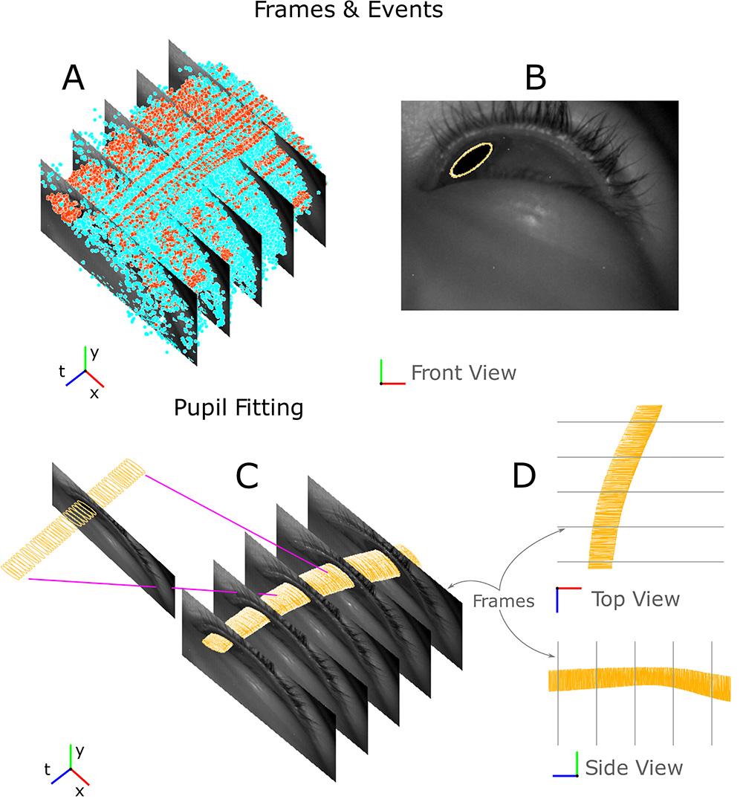
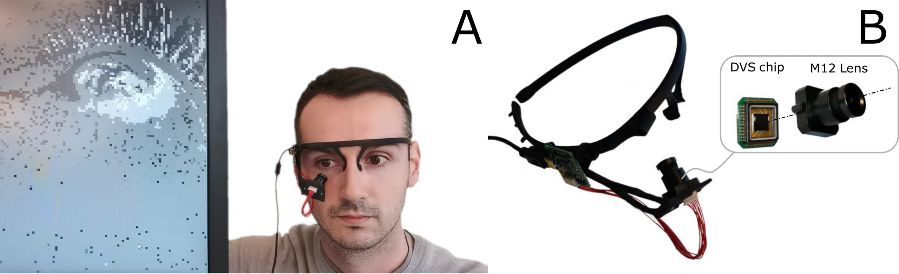
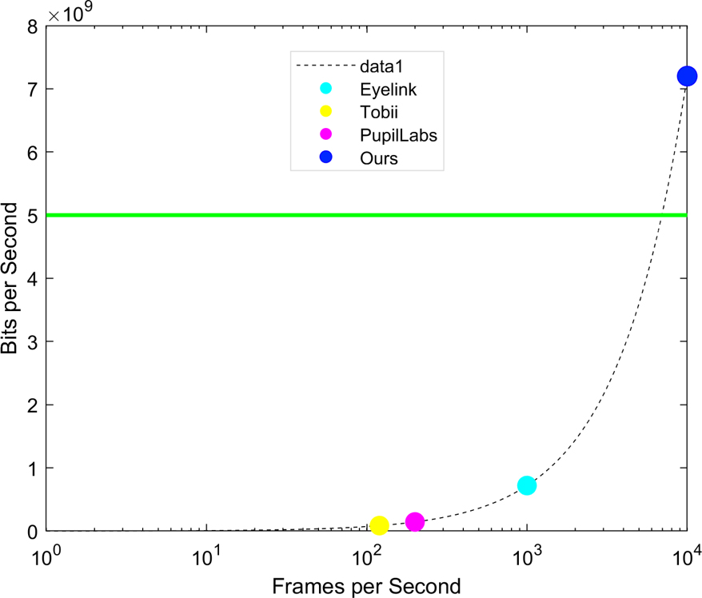
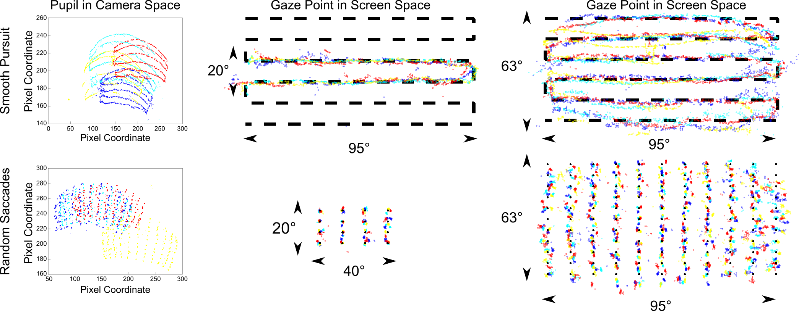

## Videos
### Project Overview (3:30 min)
<iframe width="640" height="480" src="https://www.youtube.com/embed/izE7j1b95uI"
title="YouTube video player" frameborder="0" allow="accelerometer; autoplay; clipboard-write;
encrypted-media; gyroscope; picture-in-picture" allowfullscreen></iframe>

### IEEE-VR talk (7 min)
<iframe width="640" height="480" src="https://www.youtube.com/embed/qc0f9pFiS2s" 
title="YouTube video player" frameborder="0" allow="accelerometer; autoplay; clipboard-write; 
encrypted-media; gyroscope; picture-in-picture" allowfullscreen></iframe>

## Motivation
This video shows that eye tracking video data (left) is inherently sparse. We demonstrate this by showing the temporal 
gradients of the video (right). As evident from right-hand side, only the pixels corresponding to the major eye features 
like the pupil and eyelashes change significantly over time. This sparsity is directly exploited by the event sensors 
we use for eye tracking at ultra low latency.


## System overview
This real-time video of a subject using our system shows them following a mouse cursor on-screen in real-time;
the red dots on screen plot a downsampled version of our estimate of the user’s gaze point.


### Input and output of our system
The inputs, shown in plot A, are frames recorded at a fixed sampling rate and events, 
asynchronously sampling the eye motion at high speed. Frames and events are captured by the same sensor, and event 
polarity is color coded in blue (+) or red (-). We output a gaze point, computed from our estimate of the pupil, shown 
in yellow as seen from several perspectives in plots B, C, and D (x and y are the columns and rows of the sensor, and t 
is time). Events continuously trigger between frames, allowing pupil estimation much faster than the frame rate. Every 
pupil estimate yields a yellow circle. These estimates are so frequent that they form an almost continuous tubular 
structure outlining the pupil’s movement through time in plots C and D.

### Using events and frames...
The output of the hybrid event- and frame-based camera we use in our eye tracking system includes events sampled at an 
adaptive rate determined by the motion of the eye and also frames sampled at a fixed rate. This video shows the movement
of the eye during a saccade, scanning backwards in time. Notice that the saccade begins in-between two frames, but the 
events still capture its initiation.


### ... to fit an eye model 
Our algorithm uses frames and events together to update a parametric representation of the eye in an online manner,
never storing frames or events. We use a polynomial regression to map the fitted eye model to the gaze point.


An ellipse that tracks the user’s pupil can be fit using the event-based data at 10 kHz or more when the eye moves fast. 
We plot a 1 px wide ellipse every time we fit a new pupil location, and the yellow, seemingly-continuous tube therefore
represents the very fast sampling of the pupil’s motion produced by our system.


### Miniature prototype
Our miniature prototype streams events in real time (A) and mounts on a pair of glasses (B), shown here with a M12 lens.
Data is streamed out of the prototype using less than 12 Mbits/s of bandwidth.

### Bandwidth required
The bandwidth required by a traditional camera sampling at 10 kHz would generate more data than USB-3 can carry; 
our event-based camera generates much less data by exploiting the sparsity of the signal in the sensor electronics.
The same principle also help save power.

## Dataset and results
Our dataset of saccadic movements, smooth purusit, and fixations was collected by asking the user to look at 
pre-determined locations (the snaking black line in the top row and the black dots in the bottom row). These plots 
show the output of our event-based eye tracking method for four different subjects (shown as different colors). The 
movement of the subjects’ eyes tracks the stimulus location.

## On Twitter

