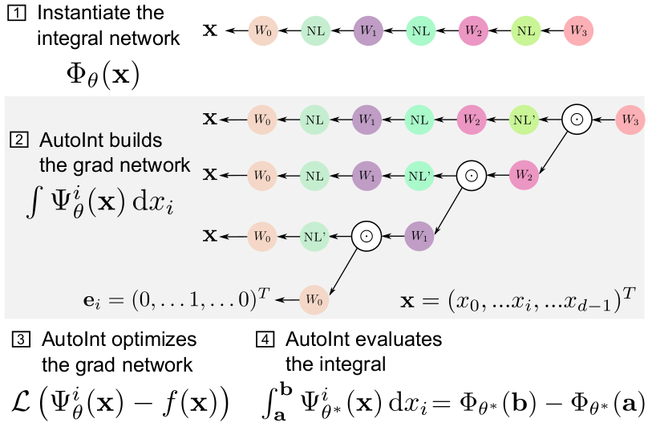

## Videos
### Technical Video (7 min)
<iframe width="640" height="480" src="https://www.youtube.com/embed/GYxFYbih0PU" title="YouTube video player" 
frameborder="0" allow="accelerometer; autoplay; clipboard-write; encrypted-media; gyroscope; picture-in-picture" 
allowfullscreen></iframe>

## The AutoInt Framework 
### Principle
After (1) defining an integral network architecture, (2) AutoInt builds the corresponding grad 
network, which is (3) optimized to represent a function. (4) Definite integrals can then be computed by evaluating the 
integral network, which shares parameters with its grad network.

### Volume rendering pipeline 
During training, the grad networks representing volume density σ and color c are optimized for a given set of multi-view 
images (top left). For inference, the grad networks’ parameters are reassembled to form the integral networks,
which represent antiderivatives that can be efficiently evaluated to calculate ray integrals through the volume 
(bottom left). A sampling network predicts the locations of piecewise sections used for evaluating the definite 
integrals (right).

## Results
### Sparse View Computed Tomography
Left: illustration of the parameterization. Center: sinograms computed with the integral networks using different 
nonlinear activation functions. The ground truth (GT) sinogram is subsampled in angle by 4× (top), 8× (middle), and 16× 
(bottom). The optimized networks are used to interpolate the missing measurements. Using the Swish activation performs 
best in these experiments. Right: 1D scanlines of the sinogram centers shows the interpolation behavior of each method 
for each subsampling level.

### Volume rendering 




## On Twitter

