## Videos
### ICCP talk (12 min)
<iframe width="640" height="480" src="https://www.youtube.com/embed/tTYHoxA2RVg"
title="YouTube video player" frameborder="0" allow="accelerometer; autoplay; clipboard-write;
encrypted-media; gyroscope; picture-in-picture" allowfullscreen></iframe>

## System overview
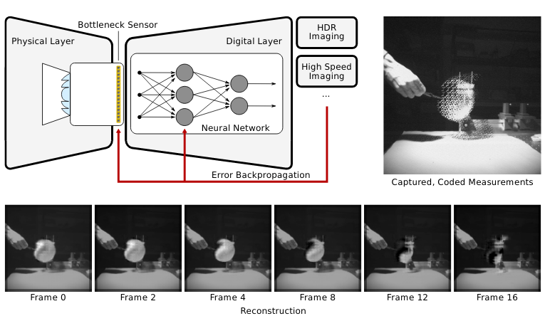
### Illustration of our end-to-end neural sensor framework.
The exposure program of a sensor (physical layer) is learned end-to-end with a decoder (digital layer) for applications 
like video compressive sensing. Here, we show a single coded exposure captured with our prototype camera and several 
frames of the high-speed video reconstructed from this image showing an exploding balloon.

### Hardware Setup
<table style="table-layout: fixed; border: none;" width="788">
<tbody>
<tr style="border: none;">
<td style="border: none; vertical-align: top;">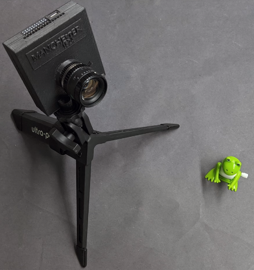</td>
<td style="border: none; vertical-align: middle;">Real captures of the coded images using the optimized shutter functions 
are performed with SCAMP-5, a programmable sensor processor.

SCAMP-5 is a 256&#215;256 pixel array in which each pixel is equipped with a small processor and a few registers.</td>
</tr>
</tbody>
</table>

## Results: real captures
<table style="padding: 1px 1px 1px 1px;" width="788">
<tbody>
<tr>
<th style="text-align: center;">Coded Exposure Image</th>
<th style="text-align: center;">Reconstructed Video</th>
</tr>
<tr>
<td style="text-align: center;" colspan="2"><strong>Water Droplet </strong><em>(video contains 64 total frames from 4 coded frames)</em></td>
</tr>
<tr>
<td style="text-align: center;">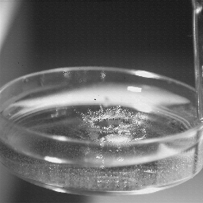</td>
<td style="text-align: center;">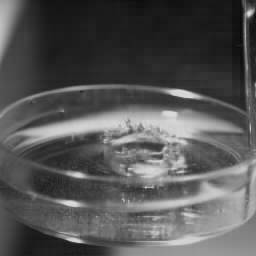</td>
</tr>
<tr>
<td style="text-align: center;" colspan="2"><strong>Rotating Fan</strong> <em>(video contains 64 total frames from 4 coded frames)</em></td>
</tr>
<tr>
<td style="text-align: center;">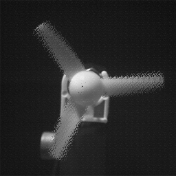</td>
<td style="text-align: center;">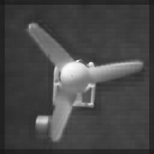</td>
</tr>
<tr>
<td style="text-align: center;" colspan="2"><strong>Jumping Frog </strong><em>(video contains 64 total frames from 4 coded frames)</em></td>
</tr>
<tr>
<td style="text-align: center;">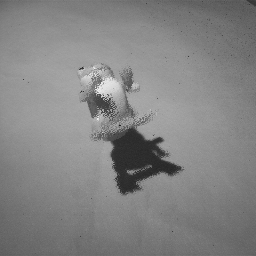</td>
<td style="text-align: center;">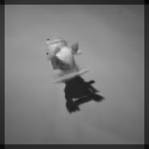</td>
</tr>
<tr>
<td style="text-align: center;" colspan="2"><strong>Oscilloscope </strong>(<em>video contains 16 total frames from 1 coded frame)</em></td>
</tr>
<tr>
<td style="text-align: center;">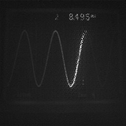</td>
<td style="text-align: center;">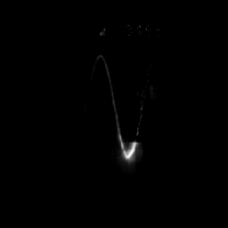</td>
</tr>
<tr>
<td style="text-align: center;" colspan="2"><strong>Balloon</strong> <em>(video contains 32 total frames from 2 coded frames)</em></td>
</tr>
<td style="text-align: center;">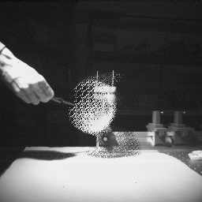</td>
<td style="text-align: center;">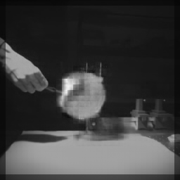</td>
<tr>
</tr>
</tbody>
</table>

## On Twitter


