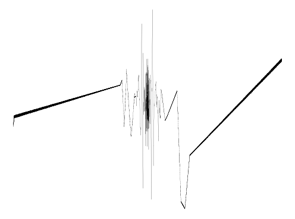

## Videos
### Technical video (10:30 min)
<iframe width="640" height="480" src="https://www.youtube.com/embed/Q2fLWGBeaiI" title="YouTube video player" 
frameborder="0" allow="accelerometer; autoplay; clipboard-write; encrypted-media; gyroscope; picture-in-picture" 
allowfullscreen></iframe>

### NeurIPS talk (10:30 min)

## Using SIRENs to represent signals
### Representing images
A Siren that maps 2D pixel coordinates to a color may be used to parameterize images. Here, we supervise Siren directly
with ground-truth pixel values. Siren not only fits the image with a 10 dB higher PSNR and in significantly fewer 
iterations than all baseline architectures, but is also the only MLP that accurately represents the first- and second
order derivatives of the image.



### Representing audio
A Siren with a single, time-coordinate input and scalar output may parameterize audio signals. Siren is the only
network architecture that succeeds in reproducing the audio signal, both for music and human voice. 

            

                <h5>Ground truth</h5>
                
                <audio
                        controls
                        src="audio/gt_bach.wav"
                        class="media-left"
                        style="width:100%">
                    Your browser does not support the
                    <code>audio</code> element.
                </audio>
            

            

                <h5>ReLU MLP</h5>
                
                <audio
                        controls
                        src="audio/relu_bach.wav"
                        class="media-left"
                        style="width:100%">
                    Your browser does not support the
                    <code>audio</code> element.
                </audio>
            

            

                <h5>ReLU P.E.</h5>
                
                <audio
                        controls
                        src="audio/relu_pe_bach.wav"
                        class="media-left"
                        style="width:100%">
                    Your browser does not support the
                    <code>audio</code> element.
                </audio>
            

            

                <h5>Siren</h5>
                
                <audio
                        controls
                        src="audio/siren_bach.wav"
                        class="media-left"
                        style="width:100%">
                    Your browser does not support the
                    <code>audio</code> element.
                </audio>
            

            

                

                    
                    <audio
                            controls
                            src="audio/gt_counting.wav"
                            class="media-left"
                            style="width:100%">
                        Your browser does not support the
                        <code>audio</code> element.
                    </audio>
                

                

                    
                    <audio
                            controls
                            src="audio/relu_counting.wav"
                            class="media-left"
                            style="width:100%">
                        Your browser does not support the
                        <code>audio</code> element.
                    </audio>
                

                

                    
                    <audio
                            controls
                            src="audio/relu_pe_counting.wav"
                            class="media-left"
                            style="width:100%">
                        Your browser does not support the
                        <code>audio</code> element.
                    </audio>
                

                

                    
                    <audio
                            controls
                            src="audio/siren_counting.wav"
                            class="media-left"
                            style="width:100%">
                        Your browser does not support the
                        <code>audio</code> element.
                    </audio>
                

        

    

### Representing videos
A Siren with pixel coordinates together with a time coordinate can be used to parameterize a video. Here, Siren is 
directly supervised with the ground-truth pixel values, and parameterizes video significantly better than a ReLU MLP. 



## Using SIRENs to solve PDEs
### Poisson equation 
By supervising only the derivatives of Siren, we can solve Poisson's equation. Siren is again the only architecture
that fits image, gradient, and laplacian domains accurately and swiftly. 



### Eikonal equation: representing shapes
We can recover an SDF from a pointcloud and surface normals by solving the Eikonal equation, a first-order boundary 
value problem. SIREN can recover a room-scale scene given only its pointcloud and surface normals, accurately 
reproducing fine detail, in less than an hour of training. In contrast to recent work on combining voxel grids with 
neural implicit representations, this stores the full scene in the weights of a single, 5-layer neural network, with 
no 2D or 3D convolutions, and orders of magnitude fewer parameters. Zoom in to compare fine detail! Note that these 
SDFs are not supervised with ground-truth SDF / occupancy values, but rather, are the result of solving the above 
Eikonal boundary value problem. This is a significantly harder task, which requires supervision in the gradient domain 
(see paper). As a result, architectures whose gradients are not well-behaved perform worse than SIREN.

            

                

                    <h4>Room - Siren</h4>
                    <model-viewer
                            alt="Room Siren"
                            src="room_siren.glb"
                            style="width: 100%; height:300px; background-color: #404040"
                            exposure=".8"
                            camera-orbit="0deg 75deg 105%"
                            auto-rotate
                            camera-controls>
                    </model-viewer>
                

                

                    <h4>Room - ReLU</h4>
                    <model-viewer
                            alt="Room ReLU"
                            src="room_relu.glb"
                            style="width: 100%; height: 300px; background-color: #404040"
                            exposure=".8"
                            auto-rotate
                            camera-controls>
                    </model-viewer>
                    <!--                            poster="https://uploads-ssl.webflow.com/51e0d73d83d06baa7a00000f/5e7e6db2d75a9b467eee4111_legomesh_cover.png"-->
                

            

            

                

                    <h4>Statue - Siren</h4>
                    <model-viewer
                            alt="Statue Siren"
                            src="statue_siren.glb"
                            style="width: 100%; height: 600px; background-color: #404040"
                            exposure=".8"
                            camera-orbit="0deg 75deg 20%"
                            auto-rotate
                            camera-controls>
                    </model-viewer>
                

                

                    <h4>Statue - ReLU Pos. Enc.</h4>
                    <model-viewer
                            alt="Statue Positional Encoding"
                            src="statue_relu_pe.glb"
                            style="width: 100%; height: 600px; background-color: #404040"
                            exposure=".8"
                            camera-orbit="0deg 75deg 20%"
                            auto-rotate
                            camera-controls>
                    </model-viewer>
                

                

                    <h4>Statue - ReLU</h4>
                    <model-viewer
                            alt="Statue ReLU"
                            src="statue_relu.glb"
                            style="width: 100%; height: 600px; background-color: #404040"
                            exposure=".8"
                            camera-orbit="0deg 75deg 20%"
                            auto-rotate
                            camera-controls>
                    </model-viewer>
                

            

        

### Hemlmholtz equation
Here, we use Siren to solve the inhomogeneous Helmholtz equation. ReLU- and Tanh-based architectures fail entirely to 
converge to a solution. 


### Wave equation
In the time domain, Siren succeeds to solve the wave equation, while a Tanh-based architecture fails to discover the 
correct solution.


## On Twitter



